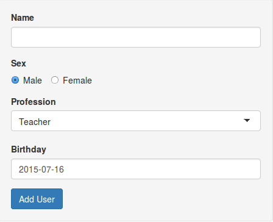
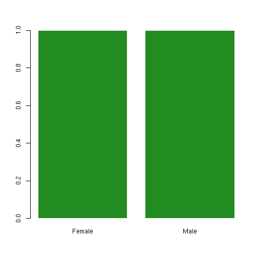

Shiny Demo on User Management
========================================================
author: ziwen sun <sun33170161@hotmail.com>
date: 2015-7-16
transition: zoom
font-family: 'Helvetica'

Introduction
========================================================

This application is to demonstrate the ability of shiny to build up an interactive web application. The example is about user management, containing following functions:

- Create User
- List Users
- Explore User Sex

Create User
========================================================
id: slide1

At the main page, input the form at the left side panel and click the *Add User* to post the user information.

***




List Users
========================================================

After the add user command is posted, we add that info to a global variale, standing for a database. 


```r
userDB <<- data.frame()
```

The real application reads data from input variable like `input$name` and insert it to the first row of the *userDB*.


Then the renderTable is used to show the final table like below:


```
  name    sex profession   birthday
1 Lucy Female    Teacher 1984-02-01
2 john   Male    Teacher 1988-12-01
```

Explore User Sex
========================================================
left: 50%

We first calculates the number of different sexes. And fill in 0 when some sex is missed. 

The right figure is the final bar plot.

[Go to Create User](#/slide1)

***

 
